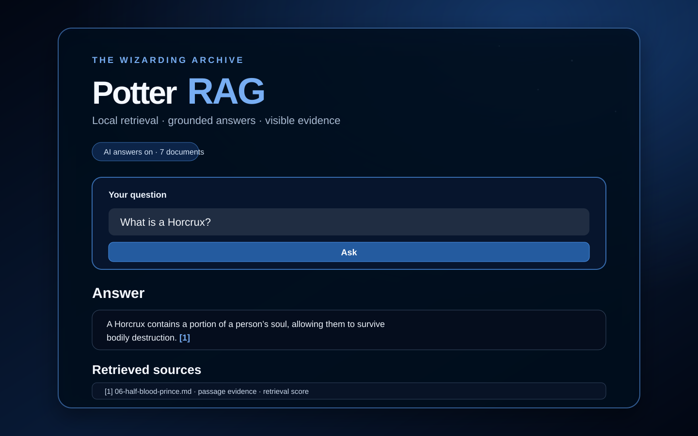
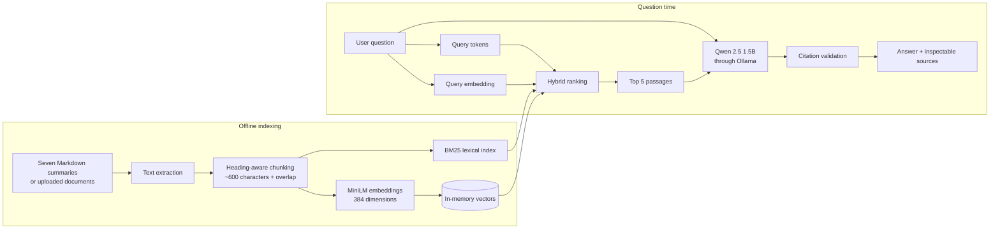

# Harry Potter Q&A — Local RAG System

An end-to-end Retrieval-Augmented Generation project that turns a seven-document Harry Potter summary corpus into a cited question-answering experience. It demonstrates the complete RAG lifecycle: document ingestion, heading-aware chunking, embeddings, hybrid retrieval, grounded generation, citation validation, evaluation, and an interactive Streamlit interface.

The project is designed as a transparent portfolio system. Every answer exposes the passages used to generate it, and unsupported questions produce an explicit abstention instead of a fabricated answer.

> The corpus contains independently written prose summaries, not the Harry Potter novels. This is an unofficial, non-commercial engineering demonstration.



## Product experience

The interface supports two workflows:

- Ask questions against the bundled seven-book summary corpus.
- Upload authorized PDF, TXT, or Markdown files and query them within the current session.

The application displays the generated answer, numbered citations, original source filename, document section, page, retrieval score, and the complete retrieved passage. A public-safe screenshot or demo GIF can be added after capture from the CSS-only interface.

## Architecture



### What happens when a question is submitted?

1. The exact question becomes the retrieval query.
2. `all-MiniLM-L6-v2` converts it into a 384-dimensional vector.
3. The system compares it with every chunk vector using cosine similarity.
4. BM25 independently scores exact words, names, and phrases.
5. Both signals are combined so semantic matches and precise keywords contribute to ranking.
6. The five highest-ranked passages are placed in a constrained evidence prompt.
7. Local `qwen2.5:1.5b` writes a short answer and cites passage IDs such as `[1]`.
8. The application validates that all cited IDs exist before displaying the answer.

If retrieval finds no supporting passage, the model is skipped and the system responds:

> I cannot answer that from the available sources.

## Why hybrid retrieval?

Dense embeddings are effective when the question and document use different wording. BM25 is stronger for exact names and short factual questions. This project combines the two signals because testing exposed a practical failure mode: embedding-only retrieval could miss a passage that contained the exact phrase “Sorting Hat.” Hybrid ranking recovered that evidence without giving up semantic search.

The implementation intentionally uses transparent exact search instead of a hosted vector database. With 138 chunks, an in-memory matrix is fast, easy to inspect, free to run, and simple to explain. A persistent vector store such as FAISS, Chroma, pgvector, or Qdrant would become valuable when the corpus grows or indexing must survive process restarts.

## Technical highlights

| Area | Implementation |
|---|---|
| Interface | Streamlit with a custom responsive dark theme |
| Corpus | Seven Markdown prose summaries |
| Ingestion | PDF, UTF-8 TXT, and Markdown |
| Chunking | Heading-aware, approximately 600 characters, 100-character overlap |
| Embeddings | `sentence-transformers/all-MiniLM-L6-v2`, 384 dimensions, CPU inference |
| Retrieval | Hybrid cosine similarity + BM25, top 5 passages |
| Generation | Local `qwen2.5:1.5b` through Ollama |
| Grounding | Evidence-only prompt, visible passages, numbered citations |
| Safety | Input limits, malformed-file handling, prompt-injection boundary, abstention |
| Testing | 22 passing automated tests; 1 optional local-AI integration test skipped by default |

## Repository structure

```text
potter-rag/
├── app.py                       # Streamlit interface and session state
├── rag.py                       # Ingestion, chunking, retrieval and generation
├── data/
│   ├── books/                   # Active seven-summary corpus
│   ├── legacy/                  # Archived starter notes
│   └── PROVENANCE.md            # Corpus and rights disclosure
├── assets/                      # Public-safe README interface preview
├── templates/                   # Reusable summary-document template
├── tests/                       # Unit, app and optional integration tests
├── evaluate.py                  # Retrieval evaluation runner
├── eval_questions.json          # Labeled retrieval questions
├── smoke_local_ai.py            # Real MiniLM + Ollama smoke test
└── validation.md                # Verification scope and limitations
```

## Run locally

Python 3.11 is recommended.

### 1. Source-search mode

This mode uses BM25 and does not require an LLM:

```bash
git clone https://github.com/ISMMO0/harry-potter-rag.git
cd potter-rag
python3 -m venv .venv
source .venv/bin/activate
python -m pip install -r requirements.txt
streamlit run app.py
```

### 2. Full local RAG mode

Install [Ollama](https://ollama.com/download), then run:

```bash
source .venv/bin/activate
python -m pip install -r requirements-ai.txt
ollama pull qwen2.5:1.5b
ollama serve
```

In a second terminal:

```bash
cd potter-rag
source .venv/bin/activate
ENABLE_LOCAL_AI=1 streamlit run app.py
```

Open `http://localhost:8501`, select **Semantic (MiniLM)** and **Local LLM (Ollama)** in Settings, and submit a question. Set `OLLAMA_MODEL` to another installed Ollama model if desired.

The embedding model downloads on first use. After that, embedding and generation can run locally without an API key or paid inference service.

## Example questions

- What does the Sorting Hat do?
- How is the basilisk defeated?
- What is a Horcrux?
- Who opened the Chamber of Secrets?
- Why does Harry enter the Forbidden Forest?
- What is the capital of Morocco? *(expected abstention)*

## Tests

```bash
source .venv/bin/activate
python -m pip install -r requirements-dev.txt
python -m pytest -q
```

Current automated result:

```text
22 passed, 1 skipped
```

The default suite checks chunk overlap and provenance, Markdown sections, PDF extraction, file limits, malformed input, BM25 ranking, dense-vector normalization, hybrid retrieval behavior, citation validation, prompt-injection separation, Ollama errors, and the main Streamlit flow.

To run the real local embedding-and-generation integration test:

```bash
RUN_LOCAL_AI_INTEGRATION=1 python -m pytest -m local_ai -q
```

## Evaluation and engineering honesty

The repository includes a small labeled retrieval dataset and evaluation runner. The checked-in JSON scores were generated for the earlier five-note demonstration corpus, so they are retained as historical artifacts—not presented as results for the current seven-summary corpus. The questions must be relabeled with the new filenames before publishing updated metrics.

This system strongly encourages grounded answers, but it does not claim that citations mathematically prove every generated sentence. The validator confirms that cited passage IDs exist; it does not perform claim-level entailment. A production-strength next step would split the answer into claims and run each claim through a verifier against its cited passage.

Other current limitations:

- Vectors are rebuilt in memory when the document collection changes.
- The small local model can still abstain incorrectly or introduce unsupported wording.
- Scanned PDFs need OCR before upload.
- Questions are independent; conversational follow-ups are not implemented.
- There is no authentication or persistent upload storage.

These constraints are shown deliberately because observability and honest failure behavior are core parts of building trustworthy GenAI systems.

## Roadmap

- Add claim-level citation verification.
- Relabel and rerun retrieval evaluation on the seven-summary corpus.
- Add reranking for difficult multi-document questions.
- Persist embeddings with FAISS, Chroma, or pgvector when corpus size justifies it.
- Add conversational query rewriting with explicit chat history.
- Add OCR for scanned documents and streaming generation.

## Responsible use

Only upload documents you are authorized to use. Uploaded files remain in the active Streamlit session and are not persisted by this application. Never commit private documents, copyrighted novels, secrets, or API keys.

Harry Potter names and concepts belong to their respective rights holders. This independent portfolio project is not official or endorsed.
